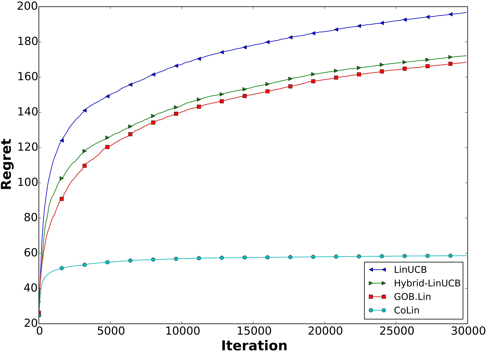
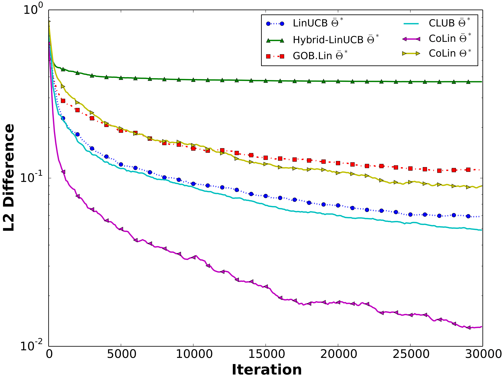

# BanditLib
This repo contains the implementation of serveral contextual bandits algorithm, including CoLin, hLinUCB, factorUCB, GOB.Lin, LinUCB, HybridLinUCB, PTS, and UCBPMF. CoLin, hLinUCB and factorUCB are our proposed algorithms published in [1], [2], [3].

##Usage
Run the simulator: `python Simulation.py --alg XXX` where parameter alg represents the name of algorithm. 

Run with different parameters: `python Simulation.py --alg XXX --contextdim XX --userNum XX --Sparsity XX --NoiseScale XX --matrixNoise  XX --hiddendim XX` 
where 
`--contextdim` stands for dimension of contextual features;
`--userNum` stands for the number of users simulated in the simulator. Each user is associated with a preference parameter, which is known to the environment but not to the algorithms. In simulator, we can choose to simulate users every time we run the program or simulate users once, save it to 'Simulation_MAB_files', and keep using it.
`--Sparsity` stands for the sparsity level of the user graph. Sparsity XX means to only maintain the top XX most connected users. Sparsity should be smaller than userNum, when equal to userNum, the graph is a full connected graph'
`--hiddendim`stands for dimension of hidden features. This parameter is specifically for the algorithms that can estimate hidden features, such as hLinUCB, PTS. For all the other contextual bandit algorithms, the default setting for this parameter should be 0.

##Result
The results will be written under folder `./SimulationResults`, including accumulated regret and parameter estimation error. You can then plot the result, and here are one example we used in [1], where we run the simulator to compare CoLin, GOB.Lin, LinUCB, and HybridLinUCB:

##Reference
[1]: Qingyun Wu, Huazheng Wang, Quanquan Gu and Hongning Wang. Contextual Bandits in A Collaborative Environment. The 39th International ACM SIGIR Conference on Research and Development in Information Retrieval (SIGIR'2016), p529-538, 2016.

[2]: Huazheng Wang, Qingyun Wu and Hongning Wang. Learning Hidden Features for Contextual Bandits. The 25th ACM International Conference on Information and Knowledge Management (CIKM 2016), p1633-1642, 2016.

[3]: Huazheng Wang, Qingyun Wu and Hongning Wang. Factorization Bandits for Interactive Recommendation. The Thirty-First AAAI Conference on Artificial Intelligence (AAAI 2017). (to appear)

